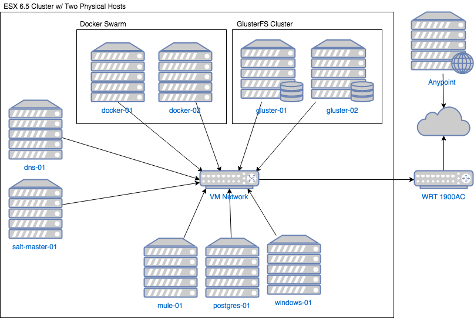

# VMware VSphere Terraform Example
## Introduction
The purpose of this example was to help determine an appropriate balance between the use of an orchestration tool like Terraform and a configuration management tool like SaltStack.  It still isn't perfect but over time I have been able to incrementally improve it.

The following are some of the key improvements that have been made:

1. Separate the top level main.tf Terraform file into seperate modules.
2. Modifying various script commands to make them more idempotent.
3. Incorporating triggers to control when a given resource needs to be recreated.
4. Externalizing my Salt configurations into a seperately versioned and deployable Git project.

This Terraform example launches three virtual machines on VMware VSphere; a SaltStack Salt Master and some number of Docker minions.  The number of Docker minions created is controlled by the count variable defined within the Docker resources in the template.  The first three Docker minions created are configured as Docker Swarm Managers with subsequent minions configured as Docker Swarm Workers.  It can work with either Ubuntu 16.04 or Centos 7 templates.

## Templates Overview
### Narrative
1. Clone an existing VMware template for each of the following virtual machines: salt-master-01, docker-01 docker-02, docker-01, etc.
2. Copy the sls files located under the config/salt/master folder to salt-master-01 and the grains file under config/salt/minion to each of Docker minions.  The latter assigns the "docker" role to the machines where Docker is to be installed and the former provides the instructions necessary for Salt to install Docker on those machines.
3. Download the SaltStack bootstrap script and run it on each of the virtual machines created in the previous step; configuring salt-master-01 as both a Salt Master and a Salt Minion, and configuring each of Docker servers as Salt Minions with a role grain equal to "docker."
4. Accept the minion keys pending registration on the Salt Master and apply a state update to all minions with a role equal to "docker."  This will install Docker (and prerequisites) on those machines and make sure the Docker service is running.
5. Initialize the Docker Swarm on docker-01; making it both a Docker Swarm Manager and the Leader.
6. Join the remaining Docker servers to the Swarm created in the previous step; making docker-02 and docker-03 into back-up Swarm Managers and all others into Swarm Workers.

### Diagram

## Running the Example
### Step-by-Step
1. Clone this repository to your local machine.
2. Download [Terraform](https://www.terraform.io/downloads.html)
3. Unzip the downloaded file and place its contents somewhere in your system path.
4. Run "terraform init" in the directory where this project was downloaded to.
5. Several variables will either need to be passed to the "terraform apply" command or provided via a specially-formatted variables.tf file in the root of the directory where this project was placed.
5. Run "terraform apply" in the directory where this project was downloaded to.

### Environment Variable Requirements
Variable Name | Description
------------- | -----------
vsphere_server | Hostname or IP address pointing to the server where the VMware vCenter Server is running.
vsphere_user | Fully-qualified username with administrative access to vCenter.
vsphere_password | Password for vsphere_user.
datacenter | Name of the vCenter Datacenter where the resource_pool, datastore, network, and template are located.
resource_pool | Name of the resource pool where the new virtual machines should run.
datastore | Name of the datastore where the new virtual machines should be persisted.
network | Name of the network that the new virtual machines should be connected to.
template | Name of the template that the new virtual machines should be cloned from.
salt_master_hostname | Name that should be assigned to the Salt Master virtual machine.
salt_num_cpus | The number of CPUs that should be assigned to the Salt Master virtual machine.
salt_memory | The amount of memory (in bytes) that should be assigned to the Salt Master virtual machine.
docker_base_hostname | Name that should be assigned to the Docker virtual machines.  This is just a base name that will have a sequential number dynamically assigned and appended to it.
docker_num_cpus | The number of CPUs that should be assigned to the Docker virtual machines.
docker_memory | The amount of memory (in bytes) that should be assigned to the Docker virtual machines.
server_type | This should be either "centos" or "ubuntu."  This drives Salt-related sls file selection as needed.
domain | This is the domain suffix that should be included to form the fully-qualified domain name of all virtual machines created.
ipv4_subnet | This is the subnet portion of the IP address that the new virtual machines should be a part of.
ipv4_host | This is the starting point for the host portion of the IP address that the new virtual machines should be assigned.  This number will be incremented as IP addresses are assigned to virtual machines.
ipv4_netmask | This is a simple integer representing the subnet mask related to the ipv4_subnet variable.
ipv4_gateway | This is the IP address of the gateway that network traffic will flow through.  This value is also used as the DNS.
ssh_username | This is the username that will be used to connect via ssh to each of the virtual machines created during setup and configuration.
ssh_password | Password for ssh_username.
cost_center_name | This is an identifying code for the department that the virtual machine(s) being provisioned will be charged to.  This will be attached to each resource created through VSphere tags.
cost_center_description | This is a meaningful description of the department that the virtual machine(s) being provisioned will be charged to.  This will be attached to each resource created through VSphere tags.
